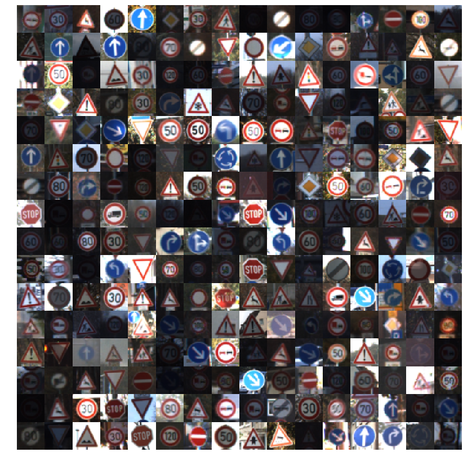
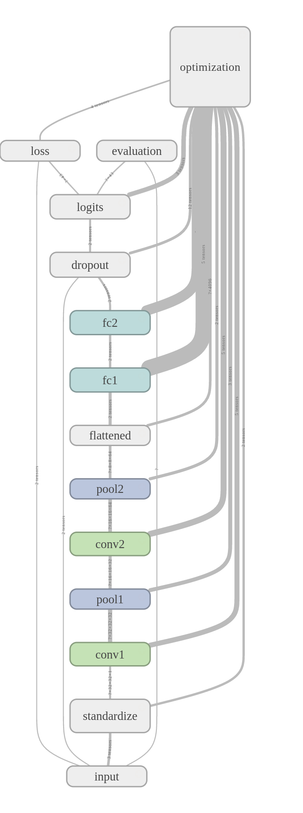

# README

### Technical Report for Traffic Sign Classification using CNN

---

**Build a Traffic Sign Recognition Project**

The goals of this project are the following:
* Load the German [Traffic Sign Dataset](http://benchmark.ini.rub.de/?section=gtsrb&subsection=dataset)
* Explore, summarize and visualize the data set
* Design, train and test a model architecture
* Use the model to make predictions on new images
* Analyze the softmax probabilities of the new images
* Summarize the results with a written report

---

### Data Set Summary & Exploration

#### 1. Provide a basic summary of the data set.

* The size of training set is **34799(67.13%)**
* The size of the validation set is **4410(8.51%)**
* The size of test set is **12630(24.36%)**
* The shape of a traffic sign image is **(32, 32, 3)**
* The number of unique classes/labels in the data set is **43**

#### 2. Include an exploratory visualization of the dataset.

Here are my exploratory visualization of the data set.

First is the image mosaicing consisting of 16*16 random samples from training dataset.



From this figure we know that **there is a significant variance between different samples in lightness**.

It is a good hint that **normalization steps such as histogram equalization and per image standardization are needed for image pre-processing**

Next comes the label histogram by subsets(training/validation/test). Here I follow Andrew Ng's notation and call validation set as dev set.


From the above visualization we know that the three subsets have approximately the same distribution.

It indicates that the three sets could be directly used for network building and evaluation.

---

### Design and Test a Model Architecture

---

#### 1. Describe how you preprocessed the image data. What techniques were chosen and why did you choose these techniques? Consider including images showing the output of each preprocessing technique.

My whole pre-processing procedure goes as follows:

1. Convert image to YUV color space
2. Extract Y-channel component and equalize its histogram
3. Generate random images by applying Euclidean transform to training set images

The first two steps are implemented as a sklearn Transformer which is included in [traffic_sign_classification.preprocessors.Preprocessor]('traffic_sign_classification/preprocessors/preprocess.py')

The code snippet is as follows:

```python
class Preprocessor(TransformerMixin):
    """ Traffic sign classification image preprocessing
    """
    def __init__(
        self,
        grayscale = False
    ):
        self.grayscale = grayscale

    def transform(self, X):
        """
        """
        return np.array(
            [self._transform(x) for x in X]
        )

    def fit(self, X, y=None):
        return self

    def set_params(self, **kwargs):
        self.__dict__.update(kwargs)

    def _transform(self, X):
        """ Convert image to YUV color space, then equalize its histogram:
        """
        # Parse image dimensions:
        H, W, C = X.shape

        # Convert to YUV:
        YUV = cv2.cvtColor(X, cv2.COLOR_RGB2YUV)

        # Extract Y channel and equalize its histogram:
        Y = cv2.split(YUV)[0]

        return cv2.equalizeHist(Y).reshape((H, W, 1))
```

The normalized images are as follows:


I choose to use grayscale only, since I think what matters for traffic sign recognition is only the shape of the symbol on the image.

The random image generator comes from Keras. Below is the code snippet:

```python
from keras.preprocessing.image import ImageDataGenerator

image_data_generator = ImageDataGenerator(
    width_shift_range = 0.25,
    height_shift_range = 0.25,
    zoom_range = 0.25,
    fill_mode='nearest'
)
```

I generate random data, because at the first iteration, the network attained zero-loss after about 10000 iterations. However, it could only achieve 92% accuracy on validation set.

Since the network show no signs of overfitting, this indicates the network suffers from the lack of training data and random samples should be generated to boost the network's performance.

Here only translation and scaling transforms are used. I think they are the only reasonable transforms to apply considering the scene in which the data is generated.

#### 2. Describe what your final model architecture looks like including model type, layers, layer sizes, connectivity, etc. Consider including a diagram and/or table describing the final model.

Below is the architectural view from Tensorboard. It's slight modification of LeNet-5, with increased depth for conv layer and widened fully connected layers.



Here is the table for detailed parameters of the network:

| Layer        |     Description	        				                                |
|:------------:|:----------------------------------------------------------------:|
| input        | placeholders for input features, labels and dropout control      |
| standardize  | per image standardization 	                                      |
| conv1				 | kernel: 5x5x32, stride: 1x1, padding: 'SAME', activation: 'ReLU' |
| pool1	       | max pooling, kernel: 2x2, stride: 2x2                            |
| conv2				 |	kernel: 5x5x64, stride: 1x1, padding: 'SAME', activation: 'ReLU'|
| pool2	       | max pooling, kernel: 2x2, stride: 2x2                            |
| flattened    | fully connected layer input                                      |
| fc1          | x1024, activation: 'ReLU'                                        |
| fc2          | 1024x512, activation: 'ReLU'                                     |
| dropout      | keep prob: 0.50                                                  |
| logits       | 512x43, activation: 'ReLU'                                       |

#### 3. Describe how you trained your model. The discussion can include the type of optimizer, the batch size, number of epochs and any hyperparameters such as learning rate.

The configuration for network training is as follows:

1. Optimizer: Adams. Adams always performs better!
2. Learning Rate: piecewise constant learning rate scheduling is used:
```python
BOUNDARIES = [
    20000, 40000, 60000
]
LEARNING_RATES = [
    1e-3, 1e-4, 1e-5, 1e-6
]

learning_rate = tf.train.piecewise_constant(
    global_step,
    BOUNDARIES,
    LEARNING_RATES
)
```
3. Batch Size: 512
4. Checkpoint Step: 2000
5. Max Iterations: 80000

#### 4. Describe the approach taken for finding a solution and getting the validation set accuracy to be at least 0.93. Include in the discussion the results on the training, validation and test sets and where in the code these were calculated.

My final model results were:

* training set accuracy of   100.00%
* validation set accuracy of  98.03%
* test set accuracy of        96.10%

The code snippet for performance evaluation is as follows:

```python
X_test_transformed = preprocessor.transform(X_test)

with tf.Session() as sess:
    saver.restore(sess, conf.model_checkpoints.format("final"))

    # Training set:
    NUM_BATCHES = int(np.ceil(M_SAMPLES / BATCH_SIZE))
    train_accuracy = 0.0
    for batch in range(NUM_BATCHES):
        X_train_transformed_batch = X_train_transformed[batch*BATCH_SIZE: (batch + 1)*BATCH_SIZE]
        y_train_batch = y_train[batch*BATCH_SIZE: (batch + 1)*BATCH_SIZE]
        train_accuracy_batch = accuracy.eval(
            feed_dict = {
                X: X_train_transformed_batch,
                y: y_train_batch,
                is_training: False
            }
        )
        train_accuracy += len(X_train_transformed_batch) * train_accuracy_batch
    train_accuracy /= M_SAMPLES

    # Valid set:
    valid_accuracy = accuracy.eval(
        feed_dict = {
            X: X_valid_transformed,
            y: y_valid,
            is_training: False
        }
    )
    # Test set:
    test_accuracy = accuracy.eval(
        feed_dict = {
            X: X_test_transformed,
            y: y_test,
            is_training: False
        }
    )

print("[Train Accuracy]: {:3.2f}".format(100*train_accuracy))     
print("[Valid Accuracy]: {:3.2f}".format(100*valid_accuracy))    
print("[Test Accuracy]: {:3.2f}".format(100*test_accuracy))
```
Here the training set is evaluated using a batch-by-batch approach to avoid memory error.

I use an iterative approach to reach the above final result:

1. In the first iteration, I used the above network without dropout and learning rate scheduling and attained 0.00 loss on training and 92% accuracy on validation set after about 10,000 iterations.
There is no sign of overfitting (consistent performance on training & validation set) so I think this bottleneck is caused by the network's hunger for training data
So I use image generator from Keras to generate more training data for network.

2. In the second iteration, I increased max iteration to 60,000 and included learning rate scheduling for further optimization.
Besides, dropout layer is added before softmax output layer so as to boost the generalization ability of the network.

The final model is slightly overfitted, in that there is a gap betweeen training set performance and that of validation set.

The results also indicates that there might be a discrepancy between training & testing set distribution since the model's performance on validation set is consistently superior than that of testing set.

However, since the model has already attained a similar performance with human being, which is a good proxy of Bayesian error
And, I don't have the patience to further fine tune the model :)

I choose this model as my final model for traffic sign classifier.

---

### Test a Model on New Images

---

#### 1. Choose five German traffic signs found on the web and provide them in the report. For each image, discuss what quality or qualities might be difficult to classify.

Here are five German traffic signs that I found on the web:


I think the first four images will be easy to classify while the last will be difficult since it contains two stacked traffic signs.

#### 2. Discuss the model's predictions on these new traffic signs and compare the results to predicting on the test set. At a minimum, discuss what the predictions were, the accuracy on these new predictions, and compare the accuracy to the accuracy on the test set.

Here are the results of the prediction:

| Image			              |     Prediction	        					|
|:-----------------------:|:---------------------------------:|
| 01-Stop      		        | Stop            									|
| 02-Speed-Limit-100 km/h | Speed limit (30km/h) 							|
| 03-Yield				        | Yield											        |
| 04-General-Caution	    | General caution					 				  |
| 05-Pedestrians     			| Speed limit (70km/h)				      |

The model was able to correctly guess 4 of the 5 traffic signs, which gives an accuracy of 80%.

Although this is not as good as its performance on test dataset(96%), I think this is really a decent performance since the fifth model is significant different than that of training set.

The pedestrians sign has triangle borders inside the training set while this one has round border.

#### 3. Describe how certain the model is when predicting on each of the five new images by looking at the softmax probabilities for each prediction. Provide the top 5 softmax probabilities for each image along with the sign type of each probability.

Below is the visualization of top-5 predictions of the above images


From the fifth visualization we know that the round border has been learned as a feature for speed limit sign prediction.

It is the round border that caused the false prediction of the fifth image.
